 

&nbsp;&nbsp;

&nbsp;&nbsp;

&nbsp;&nbsp;

 

 

 

---

&nbsp;

  

&nbsp;

 

&nbsp;

 

Synthesis reports &nbsp;·&nbsp; waveforms &nbsp;·&nbsp; design walkthroughs &nbsp;→&nbsp; <a href="https://zaileshar.github.io/"><strong>zaileshar.github.io</strong></a>

